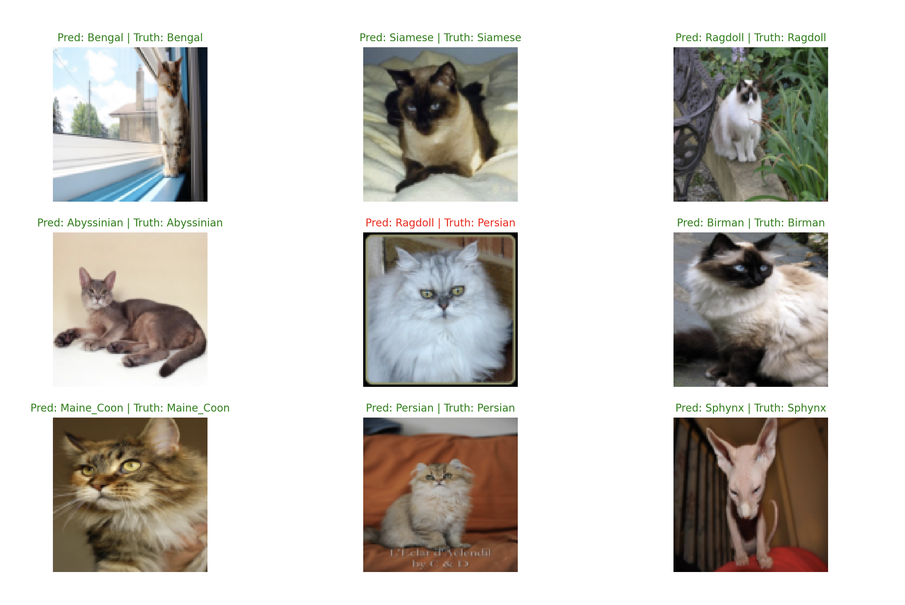
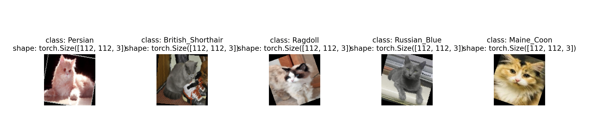

# MeowNet

CNN classifer in PyTorch that can categorize the breed of cats into 12 types: Abyssinian, Bengal, Birman, Bombay, British Shorthair, Egyptian Mau, Maine Coon, Persian, Ragdoll, Russian Blue, Siamese, Sphynx.

[MeowNet webapp](https://meownet-webapp-91b2cd8baab8.herokuapp.com/) is now available to test your own images!

## Model's Final Predictions


## Overview & Process 

My goal for this project was to get familiar with PyTorch, CNNs, and custom datasets. I also love cats but don't know much about the different breeds. This was my first time working with a custom dataset. The main issue with my dataset was the small size of the images, totaling 6,882 images. To address this, I used data augmentation (i.e., transformations) to increase the dataset size. An argument is provided where you can see how the transformations affect the images.


The architecture of the CNN is very similar to VGG-16, which I chose because of its simplicity. I started this project on Google Colab, but [Jack](https://github.com/J-Mango-19) showed me how to run PyTorch locally without access to a GPU. For this project, I used MPS, the Metal Performance Shaders backend for GPU training acceleration.

For training, I ran about 80 epochs with a learning rate of 0.001 and then lowered the learning rate to 0.0001 for around 30 more epochs.

## Usage

### Arguments

Here is the available arguments:
```
usage: main.py [-h] [-epoch EPOCH] [-save] [-load] [-view_preds] [-test TEST] [-transform]

options:
  -h, --help    show this help message and exit
  -epoch EPOCH  sets the num of epoch (def=10)
  -save         saves the model
  -load         loads a state dict
  -view_preds   view predictions model makes
  -test TEST    add path to own image to test the mode
  -transform    view what transformation looks like
```


### Executing program

Pretrained weights are saved in this repo!

* Viewing predictions model make
If you want to load pre-trained weights and view the prediction the model makes follow the command below. 
```
python3 main.py -load -epoch 0 -view_preds
```
If you want to continue to train an model and save the weights, change the epoch and follow the command below.
```
python3 main.py -load -epoch EPOCH -save -view_preds
```
* Testing saved model with your own image
```
python3 main.py -load -epoch 0 -test {path-to-your-image}
```
* View transformations used while training
```
python3 main.py -epoch 0 -transform
```
## Data
I combined two datasets in order to have better results
* [universe.roboflow](https://universe.roboflow.com/cat-breed/cat-breeds-2n7zk and https://www.kaggle.com/datasets/shawngano/gano-cat-breed-image-collection?resource=download)
* [kaggle](https://universe.roboflow.com/cat-breed/cat-breeds-2n7zk and https://www.kaggle.com/datasets/shawngano/gano-cat-breed-image-collection?resource=download)

My split was rougly 80/20 with 4149 images in my training set and 2733 in my testing set. Efforts were made to have equal amounts of images per breed per set. In the training set, the goal was ~375 images per breed and testing set was ~227 per breed. 

## Analysis

Training accuracy is ~99.44% and testing accuracy is ~91.5%. I am happy with the results and the errors seem reasonable especially with its small data size. A common mistake I noticed is difficulty classifying between Siamese and Birman or Ragdoll and Persian. This project also raises an interesting question about the potential benefits of using a cat detector to preprocess images before classification.  

## Acknowledgments

Inspiration, code snippets, recourses etc.
* [PyTorch Tutorial](https://youtu.be/Z_ikDlimN6A?si=qe1jZp6Km5sN1j92) This is how I created a custom dataset and data visualization functions 
* [VGG-16 NN Architecture](https://github.com/kennethleungty/Neural-Network-Architecture-Diagrams) Helps visualize NN arch
* [Cat Breed Classifer in Keras/TensorFlow](https://github.com/immohann/Cat-Breed-Classifier/blob/master/Cat-Breed-Classifier.ipynb) This repo inspired me to do this project
